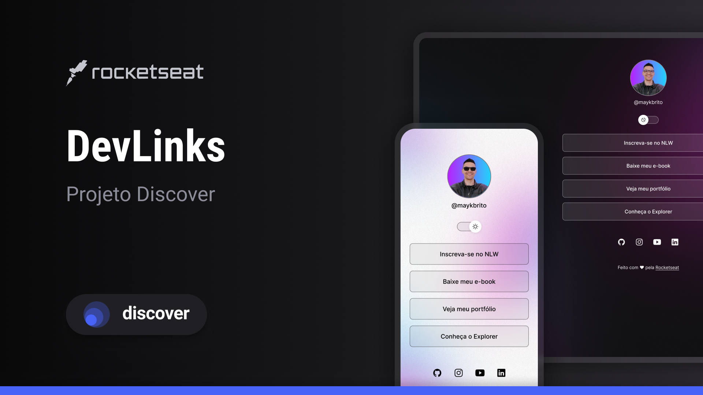

<h1 align="center"> Links </h1>

Programa exclusivo e gratuito, promovido pela Rocketseat.  

<a href="#-tecnologias">Tecnologias</a>&nbsp;&nbsp;&nbsp;|&nbsp;&nbsp;&nbsp;
<a href="#-projeto"> Projeto</a>&nbsp;&nbsp;&nbsp;|&nbsp;&nbsp;&nbsp;
<a href="#-layout">Layout</a>&nbsp;&nbsp;&nbsp;|&nbsp;&nbsp;&nbsp;
<a href="memo-licença">Licença</a>

 

## 🚀 Tecnologias

Esse projeto foi desenvolvido com as segintestecnologias:

<ul>
  <li> HTML e CSS</li>
  <li>JavaScript</li>
  <li>Git e Github</li>
  <li>Figma</li>
</u>

## 💻 Projeto

O DevLinks é um agregador de links para usar como cartão de visitas online .

-[Visite meu projeto online](https://livialausch.github.io/links)

## 📂 Layout

Você pode visualizar o layout do projeto através
[Desse link](https://www.figma.com/community/file/11874220222888947321).
É necessário ter conta no [Figma](https://figma.com) para acessá-lo.

## :memo: ✍🏻 Licença

Este projeto está sob a licença do MIT.

---

Feito com ❤
